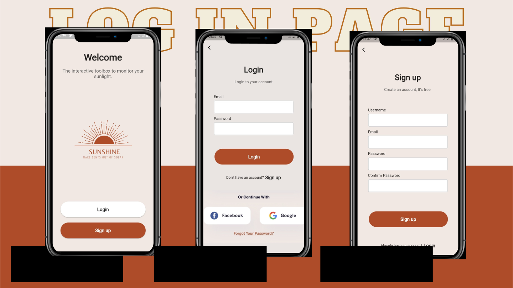
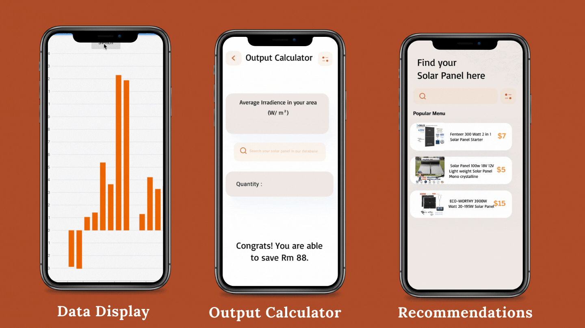
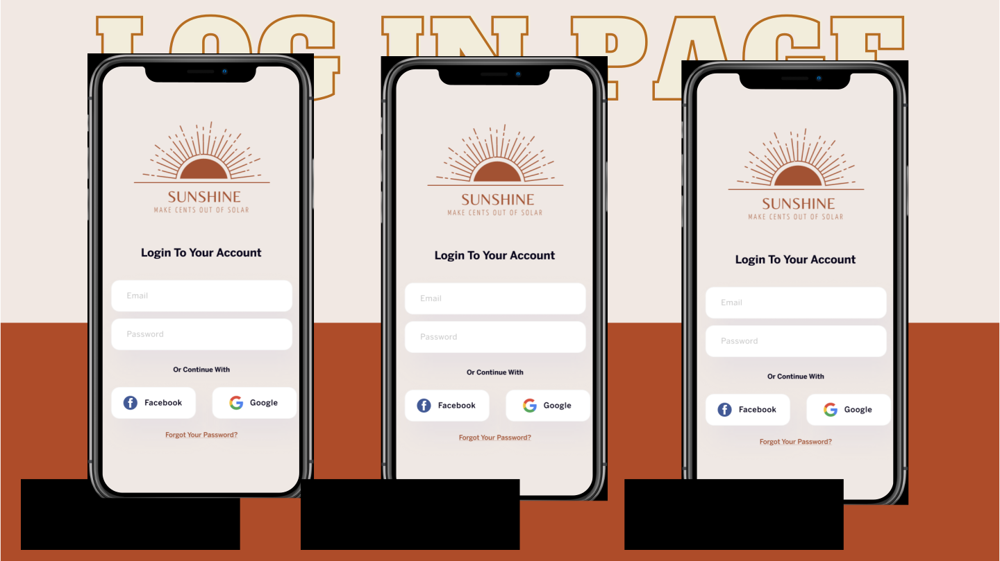

# Project SunShine

A cross-platform application developed with flutter to keep track of solar power data, calculating electricity output and recommending solar panel 

## Icon

 

## Brief Introduction

 

## Product Summary

 
## Product Tour

### Log in Page

 
Log in with your Google or Facebook account to keep track of your solar data and sync across mutiple devices!
### Location Service (with Google Map!)

 

### Main Home Page

 

## Features

 

### Solar Data Display
This Historical Data Tracker includes an interactive page to adjust parameters to view the data. Thanks to NASA Power API, we are able to request the latest data for different parameters, so there is no need to update our database frequently
### Output Calculator
This novel Solar power output calculator helps our homeowners to gauge and get amazed by how much energy solar power can save. Equipped with a simple algorithm, our calculator can compute the output of the solar panel on a particular period. By just inputting your location, we can calculate your electricity bills saved with your local rate!
### Solar Panel Recommendation
Connected with local e-commerce platforms, users can compare the prices from different merchants and even get recommendations from our ends.    
</a>

## Requirements

- Any Operating System (ie. MacOS X, Linux, Windows)
- Any IDE with Flutter SDK installed (ie. IntelliJ, Android Studio, VSCode etc)
- A little knowledge of Dart and Flutter

## Features

- [x] Monitor Solar Data
- [x] Calculate Solar Output
- [x] Get recommendation of solar panels 

## Plugins

| Name                                                    | Usage                                               |
| ------------------------------------------------------- | --------------------------------------------------- |
| [**Provider**](https://pub.dev/packages/provider)       | State Management                                    |
| [**Object DB**](https://pub.dev/packages/objectdb)      | NoSQL database to store Favorites & Downloads       |
| [**XML2JSON**](https://pub.dev/packages/xml2json)       | Convert XML to JSON                                 |
| [**DIO**](https://pub.dev/packages/dio)                 | Network calls and File Download                     |
| [**EPub Viewer**](https://pub.dev/packages/epub_viewer) | A flutter plugin for Folioreader to read ePub files |

## Author(s)

-Roger Wong Sie Yang 
-Wesley Chiang Yong Jie 
-Ryan Lin Xiao Wei 

